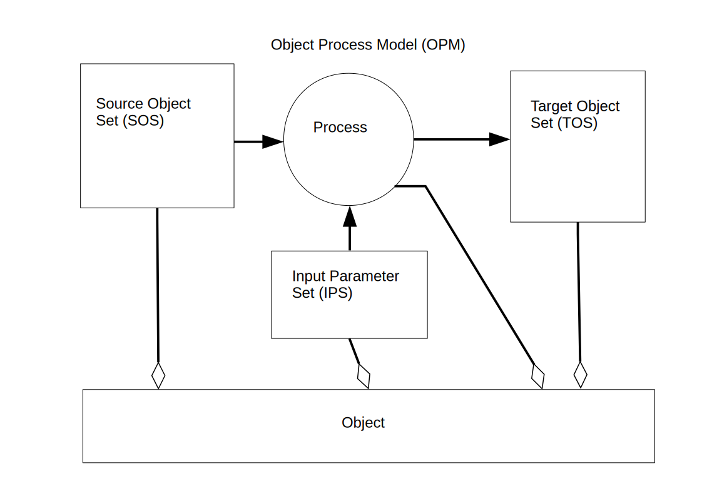

# README.md

| | |
| - | - |
| Project: | Relational Software Management System (RSMS) |
| Project context: | **Elcaro project** | 
| Project motto: | *Developing class-less software for a class-less society!* |
| Keywords: | *Software Management System*, *Relational System*, *Versioning System*, *Build System* |
| Status: | Unfinished (no code yet). See: [History](HISTORY.md) | 
| Start date: | 21 may 2019 |

## Short Description

*Object Process Model* (OPM) aims to be an **Integrated Development Environment** (IDE), but contrary to most other IDE's works with a storage format of the source code in a relational database (in renormalized/grammatical format) instead of a flat file system, quite similar to the concept of **Intentional Programming** (See: [Intentional Programming](https://en.wikipedia.org/wiki/Intentional_programming "Intentional Programming")).

An advantage of this approach is that a versioning system and build system can be built quite easiliy on top of OPM and be integral part of the IDE, where most other IDE's would rely on external tools for a versioning- and build system.

Also **Issue Tracking (IT)** and **Change Management (CM)** can be built quite easy on top of OPM. A change in **CM** is the resolution for one or more issues in **IT** and an issue is resolved by one or more changes. A **User Session (US)** is applied to a repository to implement one or more changes, and a change can be implemented using one or more **User Sessions** on the repository.

## Object Process Model (OPM)

First, the *Object Process Model* starts out from the basic idea that a **Target Object (TO)** is the result of the invocation of (some version) of a **Process Object (PO)** (which in OPM is an Object), using some **Input Parameter Set (IPS)** (which in OPM is also considered an Object) and some **Source Object Set (SOS)** (which in OPM is also considered to be an Object). In many cases the invocation of a process that creates the target object also creates other objects, so the target object is part of a **Target Object Set (TOS)** (which also is an Object in OPM).



In essence, this is also the way most build/make systems work in which we define dependency rules and operations that needs to be performed to create a target depending on one or more sources, with the exception that in OPM also the Process Object itself and the Input Parameter List are objects and can be target objects which themselves are results of the invocation of other processes to recreate the target, and so on.

```
In above example it might be implied that as soon as we for example install a new version of a compiler, 
any target that was dependend on that compiler will get automatically rebuild. In most cases, that is
not what you want. The explenation above is just a simple model of the system, leaving out many details.

In a realistic setup of OPM we will of course have setup preventive measures against unwanted automatic 
rebuilds. We can for example statically bind the target object set to a specific version of the compiling 
process, and even specific versions of the input parameter set (or parameters there-in) or set of 
source objects (or objects there-in).

Under normal operations, the object version does not change, only newer versions of that object become 
available. In exceptional cases under abornormal circumstances (f.i. some malfunction) we could need to 
change historic versions. This already necessitates manual intervention, and the process of re-compiling/
re-building then also is under manual control.
```

The difference though is that in OPM already during editting of the source text, whenever you use objects defined in some other module, this provides the information about the dependency between the object in one module and objects in other modules, and that meta-information gets stored during editting, which the internal build system of OPM uses. In traditional file based build systems that information needs to be provided explicitly in the make/build script, introducing possible errors like forgetting to include one or more dependencies in the build/make script.

Second, the OPM model has a finer granularity of object dependency then traditional build tools (which work on flat files) as source text is not stored as modules, but as individual objects in its grammatical, renormalized form as an **Abstract Syntax Tree (AST)**, so the dependencies are not just defined on the level of modules (files) but on the level of objects.

### Further reading

See: [Object Process Model](doc/OPM.md "OPM")

## Relational Software Management System (RSMS)

A *Relational Software Management System* is a software management system that provides ways to enter, change and transform software sources, keep track of changes and build a software system based on an internal storage format for the software sources and accompanying meta-information in a **Relational Database Management System (RDBMS)**. See: [RDBMS]

[RDBMS]: https://en.wikipedia.org/wiki/Relational_database "Relationa Database"

###  Further reading

See: [Relational Software Management System](doc/RSMS.md "RSMS")

